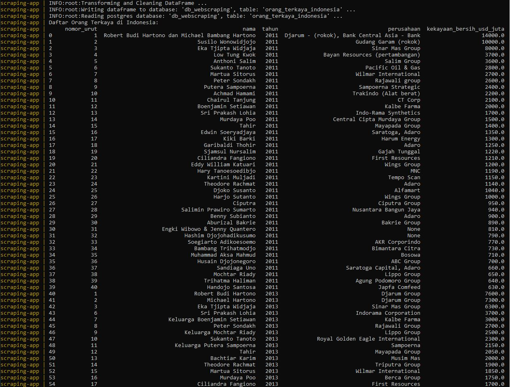
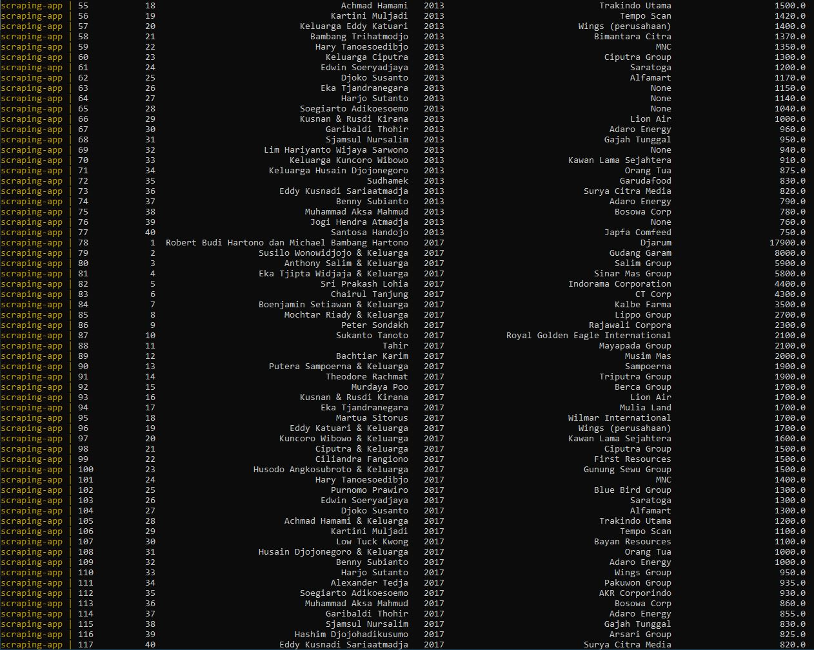
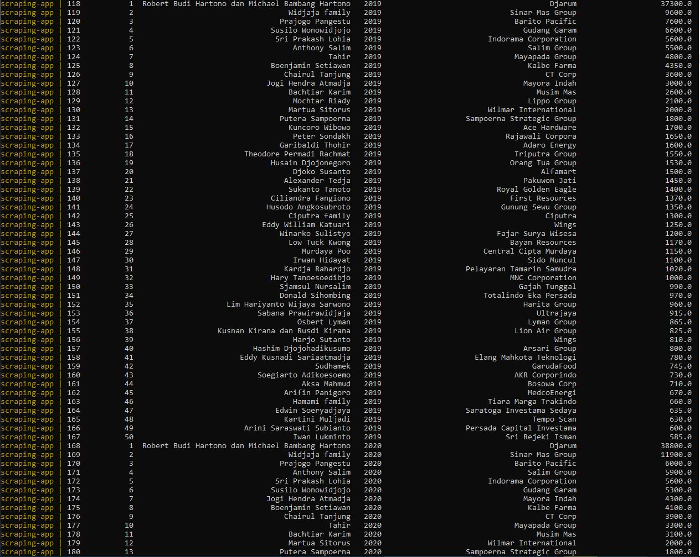
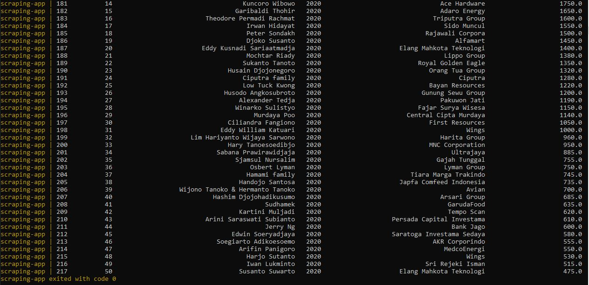

## ETL Data Orang Terkaya di Indonesia
ETL data orang terkaya di Indonesia dari website menggunakan `Python - PostgreSQL - Docker`

### Website
- URL : (https://id.wikipedia.org/wiki/Daftar_orang_terkaya_di_Indonesia)

### Requirements
- Python
- Docker

### How to Run
- Build docker image : ```docker-compose -f docker-compose.yml build```
- Menjalankan aplikasi : `docker-compose -f docker-compose.yml up`
- Mematikan aplikasi : `docker-compose -f docker-compose.yml down`

### Explanation
Aplikasi ETL untuk mengolah data orang terkaya di Indonesia dari website Wikipedia, menggunakan metode **web scraping** kemudian data di transform dan di simpan ke dalam database PostgresSQL. Aplikasi ini dijalankan dalam virtual machine Docker.

### Hasil Output




